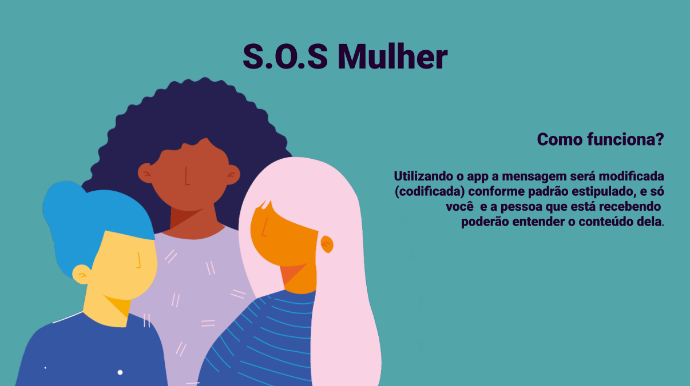

# Resumo

Este projeto foi desenvolvido como parte do objetivo de aprendizagem do Bootcamp da Laboratoria. A cifra de Cesar é um tipo de cifra de substituição, onde consiste em fazer a troca de uma letra por outra conforme a posição de deslocamento.

# Cifra de César

Em criptografia, a Cifra de César, também conhecida como cifra de troca, código de César ou troca de César, é uma das mais simples e conhecidas técnicas de criptografia. É um tipo de cifra de substituição na qual cada letra do texto é substituída por outra, que se apresenta no alfabeto abaixo dela um número fixo de vezes. Por exemplo, com uma troca de três posições, A seria substituído por D, B se tornaria E, e assim por diante. O nome do método é em homenagem a Júlio César, que o usou para se comunicar com os seus generais.

 <nav>
  <a href="https://pt.wikipedia.org/wiki/Cifra_de_César">
  </img>

  </nav>

# Tema e público alvo

Durante a pandemia os casos de violência doméstica aumentaram muito. O S.O.S Mulher tem como objetivo oferecer uma ferramenta virtual para que as mulheres vítimas de violência doméstica mandarem mensagens pedindo ajuda sem sejam descobertas.

# UI e UX

 
O Protótipo foi todo desenhado no Figma para que ficasse mais fácil a visualização de como ficaria o resultado da aplicação.

 

 
O desenho foi pensado para ser o mais simples e amigável para o usuário, a paleta de cores foi escolhida devido ao seu significado, o verde significa esperança e o roxo está geralmente ligado a campanhas para mulheres e ao feminismo.

 

 
 # Tecnologias utilizadas
 <article>
  
  
  
   </article>
   
   <footer>
  <nav>
  <a href="https://github.com/Marione-Tainara">
   
  <nav>
  </footer>
